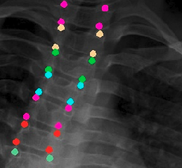
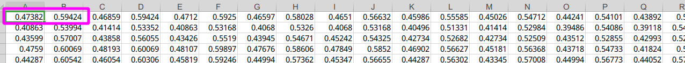

# 1. Code File Description

## 1.1 Dataset/spinal

​	It's public spinal dataset to train model

​	the data is splited to three part, for train, validate and test.

```
.
└── spinal
    ├── data
    │   ├── test
    │   ├── train
    │   └── val
    └── labels
        ├── test
        ├── train
        └── val
```

- There're spinal image files in the data dir 

  - Every spinal image has 17 bones and 17*4 = 68 landmarks(four corner),like this

    

  - 

- There're the revalent angles and landmarks in the labels dir.	

  - the angles.csv saves angles data
    - one row has three angles for every people, which has a one-to-one correspondence with each line of filenames.csv
  - the filenames.csv saves the image file name
  - the landmarks.csv saves the landamrks data.
    - one row has 68*2 coordinates( 68 landmarks, and erery landmark has its x coordinates and y coordinates)
    - such as the first landmark's coordinate is (0.47382,0.59424) on the first image



## 1.2 network model

```
├── models
│   ├── dec_net.py
│   ├── __init__.py
│   ├── model_parts.py
│   ├── resnet.py
│   └── spinal_net.py
├── decoder.py
```

the spinal_net.py saves the whole network model.

## 1.3 train,test,eval

```
├── eval.py
├── main.py
├── test.py
├── train.py
```

train--train the model

test-- test the trained model

eval--evaluate the trained model

## 1.4 other

```
├── dataset.py
├── draw_gaussian.py
├── draw_loss.py
├── draw_points.py
├── loss.py
├── pre_proc.py
├── README.md
└── transform.py
```

some tool py.file 


# Dependencies
Ubuntu 14.04, Python 3.6.4, PyTorch 1.1.0, OpenCV-Python 4.1.0.25 

# How to start	

## Train the model

```ruby
python main.py --data_dir dataPath --epochs 50 --batch_size 2 --dataset spinal --phase train
```

## Test the model
```ruby
python main.py --resume weightPath --data_dir dataPath --dataset spinal  --phase test
```


## Evaluate the model
```ruby
python main.py --resume weightPath --data_dir dataPath --dataset spinal --phase eval

```

## Run main.py